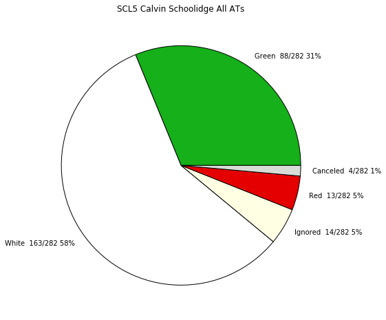
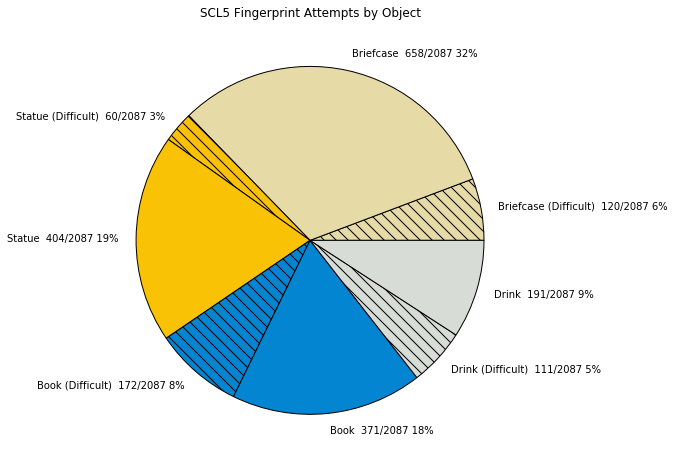
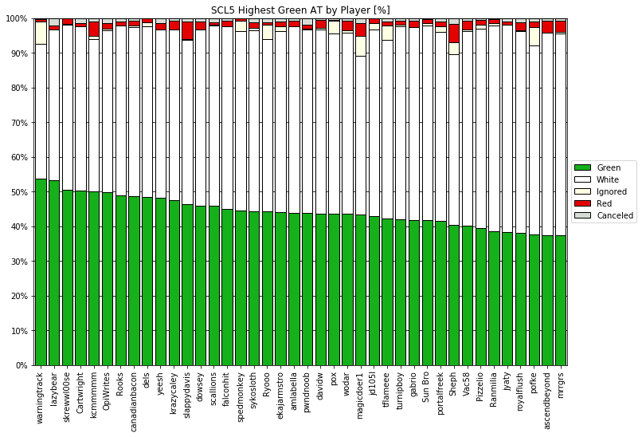
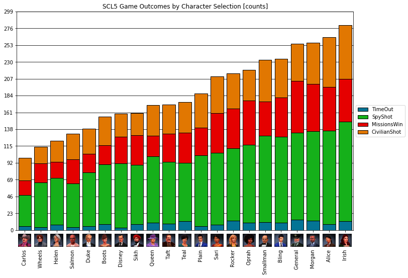

|icon| Triple Agent |py_version| |platform| |license| |build_status| 
========================================================
Triple Agent is a utility to parse and analyze the timeline component of SpyParty replays. [1]_  The Triple Agent repository also contained pre-parsed games from recent Spy Party competitive events that can be analyzed without spending the time to parse.

Triple Agent works by automatically scrolling and taking screenshots of the timeline of games, but *is not able to directly read timeline content from replay files at this time*.  Because of this, it is likely to work only on my machine until work is done to make the code more generic.  This means that parsing does require a computer with SpyParty installed, and may not work will all setups currently. [1]_.  Once the screenshots are taken, optical character recognition (OCR) is used to extract the relevant information and store it as a python object so it can be analyzed.

See `Installation Instructions`_ for how to get everything installed, and check out `Pre-parsed Events`_ for details on which events have replays parsed already.

Available Replay Data
______________
Available data includes anything that can be seen directly from the timeline including:

- Timeline event text & times
- Cast data
- Partial mission progress
- Drink and Book takes

But excludes:

- Spatial data (time add locations, which statues was picked up, etc.)
- Animation data (starting statue layout, number of read animations, idle times, etc.)

Examples
________
The examples_ folder showcases some of the most interesting or useful statistics that can be obtained with this data.

Pre-Parsed Events
___________
This repo contains serialized files for all the replays covering SCL4 Regular Season, SCL5 Regular Season, Winter Cup 2019, Summer Cup 2019.  For SCL seasons, week and division information is included in the game data.

Thanks
______

* checker for making SpyParty
* LtHummus for the `SpyPartyParse`_ library, which was extremely helpful in developing Triple Agent.
* WarningTrack for `SpyParty Fans`_, and the competitive replay downloads, which were a major help with this project.

License
-------
This project is licensed under the MIT License - see the `LICENSE.md`_ file for details

.. [1] At this time, parsing is not fully automated and may not work for all setups, see `Parsing Quirks`_ for more information. 

.. _SpyParty: http://www.spyparty.com/
.. _LICENSE.md: LICENSE.md
.. _`Python 3.7`: https://www.python.org/downloads/windows/
.. _SpyPartyParse: https://github.com/LtHummus/SpyPartyParse
.. _`SpyParty Fans`: https://www.spypartyfans.com/
.. _examples: examples
.. _`Parsing Quirks`: ../../wiki/Parsing-Quirks
.. _`Pre-parsed Events`: ../../wiki/Available-Parsed-Replays
.. _`Installation Instructions`: ../../wiki/Installation-Instructions
.. |icon| image:: triple_agent/images/icons/magnifying_glass_icon.svg
  :height: 32px
  :width: 32px

.. |py_version| image:: https://img.shields.io/badge/python-3.7-blue.svg
.. |platform| image:: https://img.shields.io/badge/platform-windows--x64-blue.svg
.. |build_status| image:: https://ci.appveyor.com/api/projects/status/vrw0751wstpa6pf7?svg=true
.. |license| image:: https://img.shields.io/github/license/andrewzwicky/TripleAgent.svg?color=blue
